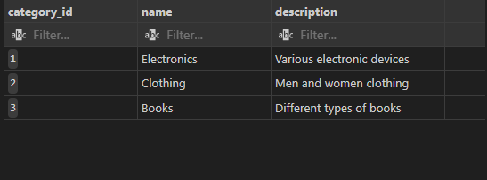
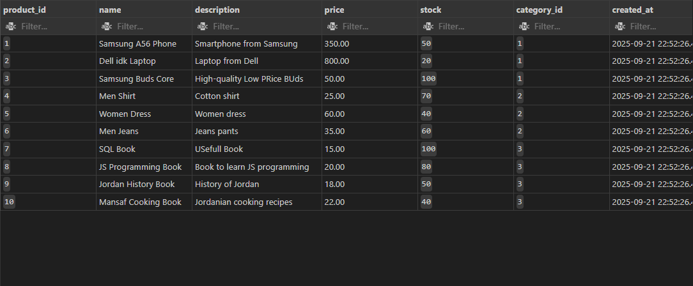
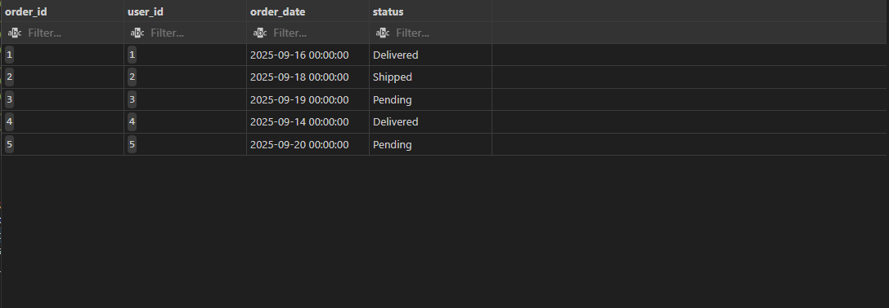
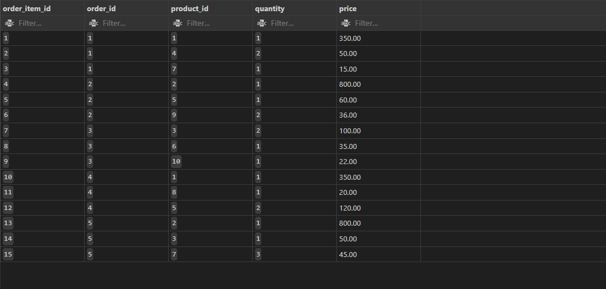

# HW MySQL Project

## Project Overview
This MySQL project manages users, products, categories, orders, and order items. It demonstrates data creation, querying, updates, triggers, and views for an e-commerce-style database.

---

## Database Tables

### 1. `users`
| Column Name | Type         | Key      | Description                  |
|-------------|-------------|---------|------------------------------|
| user_id     | INT         | PK      | Auto-incremented user ID     |
| name        | VARCHAR(100)|         | User's name                  |
| email       | VARCHAR(150)| UNIQUE  | User email                   |
| password    | TEXT        |         | User password                |
| created_at  | TIMESTAMP   |         | Account creation timestamp   |

### 2. `categories`
| Column Name   | Type         | Key | Description            |
|---------------|-------------|-----|------------------------|
| category_id   | INT         | PK  | Auto-incremented ID    |
| name          | VARCHAR(100)|     | Category name          |
| description   | TEXT        |     | Description of category|

### 3. `products`
| Column Name   | Type          | Key | Description                         |
|---------------|--------------|-----|-------------------------------------|
| product_id    | INT          | PK  | Auto-incremented product ID          |
| name          | VARCHAR(150) |     | Product name                         |
| description   | TEXT         |     | Product description                  |
| price         | DECIMAL(10,2)|     | Product price                        |
| stock         | INT          |     | Available stock                       |
| category_id   | INT          | FK  | References `categories(category_id)` |
| created_at    | TIMESTAMP    |     | Timestamp of product creation        |

### 4. `orders`
| Column Name | Type       | Key | Description                       |
|-------------|-----------|-----|-----------------------------------|
| order_id    | INT       | PK  | Auto-incremented order ID         |
| user_id     | INT       | FK  | References `users(user_id)`       |
| order_date  | TIMESTAMP |     | Date of the order                 |
| status      | ENUM      |     | Order status: Pending, Shipped, Delivered |

### 5. `order_items`
| Column Name    | Type          | Key | Description                         |
|----------------|--------------|-----|-------------------------------------|
| order_item_id  | INT          | PK  | Auto-incremented item ID             |
| order_id       | INT          | FK  | References `orders(order_id)`       |
| product_id     | INT          | FK  | References `products(product_id)`   |
| quantity       | INT          |     | Quantity ordered                     |
| price          | DECIMAL(10,2)|     | Price per item                       |

---

## Views & Triggers

### View: `order_full_details`
- Combines order, user, product, and order item details into a single view.
- Columns: `order_id`, `user_name`, `product_name`, `quantity`, `price`, `total_price`.

### Trigger: `trigger_check_stock`
- Runs **before inserting** into `order_items`.
- Checks if `quantity` exceeds current stock; throws an error if insufficient.

### Trigger: `update_stock_after_insert`
- Runs **after inserting** into `order_items`.
- Deducts the ordered quantity from the corresponding product stock.

---
---

## 1. Database Tables

**Users Table**  
```sql
SELECT * FROM users;
```
---
**Caregories Table**  
```sql
SELECT * FROM categories;
```


---
**Products Table**  
```sql
SELECT * FROM products;
```


---
**Orders Table**  
```sql
SELECT * FROM orders;
```



---
**Order Items Table**  
```sql
SELECT * FROM order_items;
```


---
2. Part 3: Simple Queries

Query: Select product info
```sql
SELECT name, price, stock FROM products;
```


Query: Orders of user_id = 1
```sql
SELECT * FROM orders WHERE user_id = 1;
```


Query: Products in category_id = 2
```sql
SELECT name, price, stock FROM products WHERE category_id = 2;
```


3. Part 4: Aggregations and Reports

Query: Total amount per order
```sql
SELECT 
    o.order_id,
    u.name AS user_name,
    SUM(oi.quantity * oi.price) AS total_amount
FROM orders o
JOIN users u ON o.user_id = u.user_id
JOIN order_items oi ON o.order_id = oi.order_id
GROUP BY o.order_id, u.name
ORDER BY o.order_id;
```


Query: Most sold product
```sql
SELECT 
    p.name AS product_name,
    SUM(oi.quantity) AS total_quantity_sold
FROM order_items oi
JOIN products p ON oi.product_id = p.product_id
GROUP BY p.name
ORDER BY total_quantity_sold DESC
LIMIT 1;
```


Query: Number of orders per user
```sql
SELECT 
    u.name AS user_name,
    COUNT(o.order_id) AS orders_count
FROM users u
LEFT JOIN orders o ON u.user_id = o.user_id
GROUP BY u.name
ORDER BY orders_count DESC;
```


Query: Order items with total price
```sql
SELECT 
    o.order_id,
    p.name AS product_name,
    oi.quantity,
    oi.price,
    (oi.quantity * oi.price) AS total_price
FROM order_items oi
JOIN orders o ON oi.order_id = o.order_id
JOIN products p ON oi.product_id = p.product_id
ORDER BY o.order_id, oi.order_item_id;
```


4. Part 5: Updates and Deletes

Update product stock
```sql
UPDATE products SET stock = stock - 2 WHERE product_id = 1;
SELECT * FROM products WHERE product_id = 1;
```


Update order status
```sql
UPDATE orders SET status = 'Shipped' WHERE order_id = 3 AND status = 'Pending';
SELECT * FROM orders WHERE order_id = 1;
```


Delete a product
```sql
DELETE FROM products WHERE product_id = 10;
SELECT * FROM products WHERE product_id = 10;
```


5. Views and Triggers

View: order_full_details
```sql
CREATE OR REPLACE VIEW order_full_details AS
SELECT 
    o.order_id,
    u.name AS user_name,
    p.name AS product_name,
    oi.quantity,
    oi.price,
    (oi.quantity * oi.price) AS total_price
FROM orders o
JOIN users u ON o.user_id = u.user_id
JOIN order_items oi ON o.order_id = oi.order_id
JOIN products p ON oi.product_id = p.product_id;

SELECT * FROM order_full_details;
```


Trigger: Check stock before inserting order item
```sql
DELIMITER $$
CREATE TRIGGER trigger_check_stock
BEFORE INSERT ON order_items
FOR EACH ROW
BEGIN
    DECLARE current_stock INT;
    SELECT stock INTO current_stock FROM products WHERE product_id = NEW.product_id;
    IF NEW.quantity > current_stock THEN
        SIGNAL SQLSTATE '45000' SET MESSAGE_TEXT = CONCAT('Not enough stock for product_id ', NEW.product_id);
    END IF;
END$$
DELIMITER ;
```

Trigger: Update stock after inserting order item
```sql
DELIMITER $$
CREATE TRIGGER update_stock_after_insert
AFTER INSERT ON order_items
FOR EACH ROW
BEGIN
    UPDATE products SET stock = stock - NEW.quantity WHERE product_id = NEW.product_id;
END$$
DELIMITER ;
```


This README:
  
- Shows **query results or table structure** visually.  
- Combines **all parts in a single file** for easy reference.  

